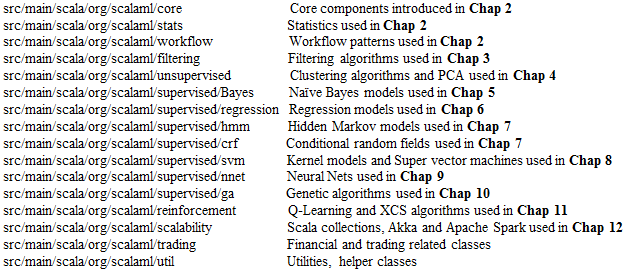
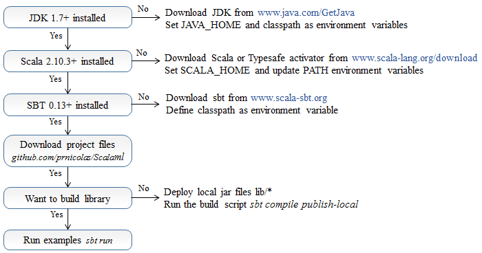

<b>Scala for Machine Learning</b> Version <b>0.98</b> 
Copyright Patrick Nicolas All rights reserved 2013-2015 
================================================================= 
Source code, data files and utilities related to "Scala for Machine Learning" 
<a href="#overview">Overview</a> 
<a href="#requirements">Minimum requirements</a> 
<a href="#documentation">Documentation</a> 
<a href="#project">Project</a> 
<a href="#installation">installation</a> 
<a href="#build">build</a> 
<a href="#run">Run examples</a> 
<a href="#persistency">Persistent models and configurations</a> 
<a href="#appendix">Appendix</a> 

<h2 id="overview">Overview</h2>
The source code provides software developers with a broad overview of the difference in machine learning algorithms. The reader is expected to have a good grasp of the Scala programming language along with some knowledge in basic statistics. Experience in data mining and machine learning is not a pre-requisite.  
Source code guidelines are defined in the companion document <b>SourceCodeGuide.html</b> 

The examples are related to investment portfolio management and trading strategies. For the readers interested either in mathematics or the techniques implemented in this library, I strongly recommend the following readings:
<ul>
<li>"Machine Learning: A Probabilistic Perspective" K. Murphy</li>
<li>"The Elements of Statistical Learning" T. Hastie, R. Tibshirani, J. Friedman</li>
</ul>
The real-world examples, related to financial and market analysis, used for the sole purpose of illustrating the machine learning techniques. They do not constitute a recommendation or endorsement of any specific investment management or trading techniques. 
The Appendix contains an introduction to the basic concepts of investment and trading strategies as well as technical analysis of financial markets. 

<h2 id="Documentation">Documentation</h2>
The best approach to learn about any particular learning algorithm is to 
<ul>
<li>Read the appropriate chapter (i.e. <i>Chapter 5: Naive Bayes modelsM</i>)</li>
<li>Review source code guidelines used in the book <i>SourceCodeGuide.html</i></li>
<li>Review scaladoc in scala_2.10-0.98-javadoc.jar</li>
<li>Look at the examples related to the chapter (i.e. <i>org/scalaml/app/chap5/Chap5</i>)</li>
<li>Browse through the implementation code (i.e. <i>org/scalaml/supervised/bayes</i>)</li>
</ul>
<h2 id="requirements">Minimum Requirements</h2>
<b>Hardware</b>: 2 CPU core with 4 Gbytes RAM for small datasets to build and run examples. 
4 CPU Core and 8+ Gbytes RAM for datasets of size 75,000 or larger and/or with 50 features set or larger
 
<b>Operating system</b>: None 
<b>Software</b>: JDK 1.7.0_45 or 1.8.0_25, Scala 2.10.3/2.10.4 or 2.11.1 and SBT 0.13+ (see installation section for deployment. 

<h2 id="project">Project Components</h2>
Directory structure of the source code library for <i>Scala for Machine Learning</i>: 
 
 
Directory structure of the source code of the examples for <i>Scala for Machine Learning</i>: 
 
 

<h2 id="installationbuild">Installation and Build</h2>
<h3 id="installation">Installation</h3>
The installation and build workflow is described in the following diagram: 
 
<b>Eclipse</b>
The Scala for Machine Learning library is compatible with Eclipse Scala IDE 3.0 
Specify link to the source in <i>Project/properties/Java Build Path/Source</i>. The two links should be <i>project_name/src/main/scala</i> and <i>project_name/src/test/scala</i> 
Add the jars required to build and execute the code within Eclipse <i>Project/properties/Java Build Path/Add External Jars</i>as declared in the <i>project_name/.classpath</i> 
Update the JVM heap parameters in eclipse.ini file as <i>-Xms512m -Xmx8192m</i> or the maximum allowed on your specific machine.
 
<h3 id="build">Build</h3>
The Simple Build Too (SBT) has to be used to build the library from the source code using the <i>build.sbt</i> file in the root directory 
Executing the examples/test in Scala for Machine Learning require sufficient JVM Heap memory (~2G): 
in <i>sbt/conf/sbtconfig.text</i> set Xmx to 2058m or higher, -XX:MaxPermSize to 512m or higher i.e. <b>-Xmx4096m -Xms512m -XX:MaxPermSize=512m</b>  
Build script for <i>Scala for Machine Learning</i>: 
To build the Scala for Machine Learning library package <i><b> $(ROOT)/sbt clean publish-local</b></i> 
To build the package including test and resource files <i><b> $(ROOT)/sbt clean package</b></i> 
To generate scala doc for the library <i><b> $(ROOT)/sbt doc</b></i> 
To generate scala doc for the examples <i><b> $(ROOT)/sbt test:doc</b></i> 
To compile all examples: <i><b>$(ROOT)/sbt test:compile</b></i> 
<h2 id="run">Run examples</h2>
<h3>examples in a chapter</h3>
To run the examples of a particular chapter (i.e. Chapter 4) 
<b>$sbt 
&#62;test-only org.scalaml.app.chap4.Chap4</b>
<h3>All examples</h3>
To run all examples with output configuration: 
$<b>sbt "test:run options"</b> where options is a list of possible outputs<ul>
<li><b>console</b> to output results onto standard output</li> 
<li><b>logger</b> to output results into a log file (log4j)</li>
<li><b>chart</b> to plot results using <i>jFreeChart</i></li>
</ul>
$<b>sbt "test:run log chart"</b> write test results into a log and charts 
$<b>sbt test:run</b> write test results into the standard output and the charts. 

<h2 id="persistency">Persistent models and configurations</h2>
The package object <b>org.scalaml.core.Design</b> provide the trait (or skeleton implementation) of the persistent model <b>Design.Model</b> and configuration <b>Design.Config</b>. 
The persistency mechanisms is implemented for a couple of supervised learning models only for illustration purpose. The reader should be able to implement the persistency for configuration and models for all relevant learning algorithms using the template operator << and >>  

<h2 id="appendix">Appendix</h2>
The examples have been built and tested with the following libraries: 
<b>Java libraries</b> 
CRF-Trove_3.0.2.jar 
LBFGS.jar 
colt.jar 
CRF.jar 
commons-math3-3.3.jar 
libsvm.jar 
jfreechart-1.0.17/lib/jcommon-1.0.21.jar 
jfreechart-1.0.17/lib/servlets.jar 
junit-4.11.jar 
jfreechart-1.0.17/lib/jfreechart-1.0.17.jar 
<b>Scala 2.10.x related libraries</b> 
com.typesafe/config/1.2.1/bundles/config.jar 
akka-actor_2.10-2.2.3.jar 
scalatest_2.11.jar 
spark-assembly-1.0.2-hadoop2.4.0.jar 
<b>Scala 2.11.x related libraries</b> 
com.typesafe/config/1.2.2/bundles/config.jar 
scalatest_2.11.jar 
akka-actor_2.11-2.3.6.jar 
spark-assembly-1.1.0-hadoop2.4.0.jar

